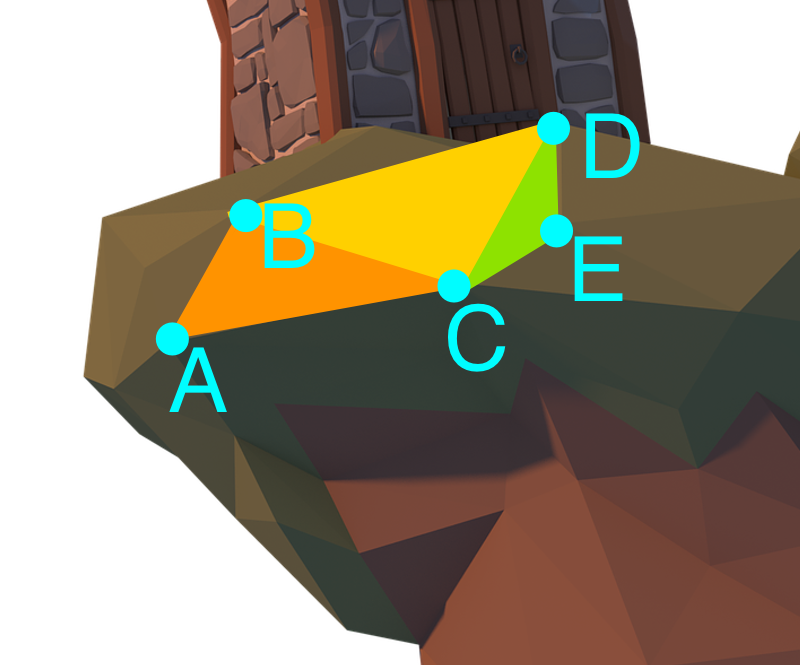
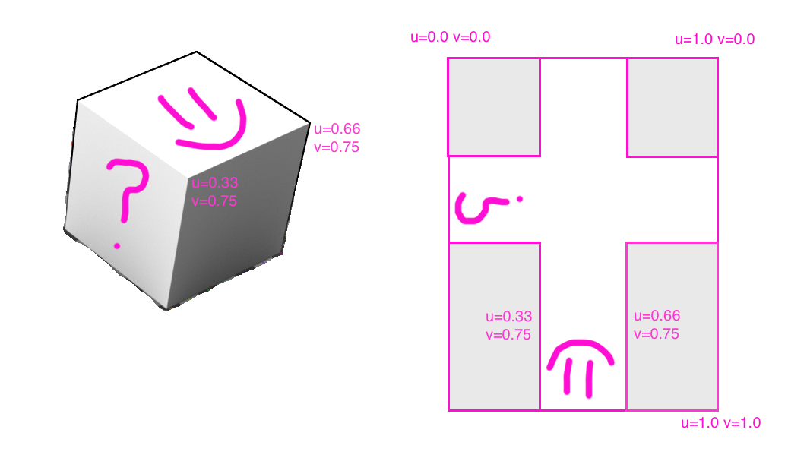

# [Fit] Metal for the _masses_
## [Fit] A low level GPU primer
## [Fit] for regular app developers
### [@nevyn](https://twitter.com/nevyn), [@lookback](https://twitter.com/lookback)
#### Cocoaheads #100, 2019-05-27

--- 

# [Fit] @nevyn

---


---

# [fit] https://github.com/
# [fit] _nevyn/LBMediaToolkit_

---

# [fit] Metal


---


---

```swift
override func draw(_ rect: CGRect) {
    let ctx = UIGraphicsGetCurrentContext()
    ctx?.saveGState()
    var cgImage : CGImage? = nil
    
    ctx?.translateBy(
        x: displaySettings.mirrorHorizontally ? 
            self.bounds.width : 
            0, y: self.bounds.height)
            
    ctx?.scaleBy(x: displaySettings.mirrorHorizontally ? -1 : 1, y: -1)
    
    VTCreateCGImageFromCVPixelBuffer(
        pixels, options: nil, imageOut: &cgImage)
        
    if let cgImage = cgImage {
        ctx?.draw(cgImage, in: self.bounds)
    }
    ctx?.restoreGState()
}
```

---


---

# Geometry
# Textures
# Pipeline
# Metal drawing
# Shaders

---

# [fit] _Geometry_


<!-- https://pixabay.com/illustrations/lowpoly-3d-blender-polygon-tree-3494476/ -->

---


# Mesh
## Triangle
## Vertex
### Point


---


---

`geom = [A, B]`


---

`geom = [A, B, C]`


---

`geom = [A, B, C, D]`


---

`geom = [A, B, C, D, E]`



---

```swift
    struct Vertex
    {
        var x, y: Float
    }
    struct Quad
    {
        var bl, br, tl, tr: Vertex
    }
    var quad = Quad(
        bl: Vertex(x: -1.0, y: -1.0),
        br: Vertex(x:  1.0, y: -1.0),
        tl: Vertex(x: -1.0, y:  1.0),
        tr: Vertex(x:  1.0, y:  1.0)
    )
```


---

# [fit] _Textures_


---


---



---

```swift

    struct Vertex
    {
        var x, y: Float
        var u, v: Float
    }
    struct Quad
    {
        var bl, br, tl, tr: Vertex
    }
    var quad = Quad(
        bl: Vertex(x: -1.0, y: -1.0, u: 0.0, v: 1.0),
        br: Vertex(x:  1.0, y: -1.0, u: 1.0, v: 1.0),
        tl: Vertex(x: -1.0, y:  1.0, u: 0.0, v: 0.0),
        tr: Vertex(x:  1.0, y:  1.0, u: 1.0, v: 0.0)
    )

```

---

# [fit] _Pipeline_

---


<!-- https://whimsical.com/4a1QDLoghGTA6TAL1qGzyr -->

---

## [fit] MetalKit

---

```swift

class RealtimeVideoMetalView : MTKView
{
    // public API
    var pixels: CVPixelBuffer? = nil
    var displaySettings = RealtimeVideoView.DisplaySettings()
    
    // internals
    private let device: MTLDevice                       // 1
    private let commandQueue : MTLCommandQueue          // 2
    private let library : MTLLibrary                    // 3
    private let textureCache : CVMetalTextureCache      // 4
    private var pipelineState : MTLRenderPipelineState! // 5
    private var vertecBuffer: MTLBuffer                 // 6
    private var matrixBuffer: MTLBuffer

```
---

## Metal thingies (1/2)

* _Device_ = your graphics card
* _Command queue_ = list of things the CPU wants to tell the GPU
    * _Render encoder_ = Main API to draw stuff. Sort of like **KeyedArchiver** but for putting commands on the queue 

---

## Metal thingies (2/2)

* _Library_ = Where you keep your shaders
* _Texture cache_ = Where you keep your textures
* _Buffer_ = Memory allocated on GPU, for geometry, matrices etc.
* _Pipeline state_ = Keeps track of how your GPU is set up


---

```swift

    init?(_: Void)
    {
        device = MTLCreateSystemDefaultDevice()!,
        commandQueue = d.makeCommandQueue()!
        library = d.makeDefaultLibrary()!
        _ = try! CVMetalTextureCacheCreate(
            nil, nil, device, nil, &textureCache
        )
        
        // x y u v (4 floats) * 4 verts = 16 floats
        let dataSize = 16 * MemoryLayout<Float>.size
        vertexBuffer = device.makeBuffer(length: dataSize)!
        // transformation matrix is a 4x4 matrix = 16 floats too
        matrixBuffer = device.makeBuffer(length: dataSize)!
        
        super.init(frame: frame, device: device)
        ...
```

---

```swift
        ...
        let descriptor = MTLRenderPipelineDescriptor()
        descriptor.vertexFunction = 
            library.makeFunction(name: "modelTransform")!
            
        descriptor.fragmentFunction = 
            library.makeFunction(name: "yuvToRgba")!
        
        descriptor.colorAttachments[0]
            .pixelFormat = self.colorPixelFormat
            
        pipelineState = try!
            d.makeRenderPipelineState(descriptor: descriptor)
            
        self.clearColor = transparent
        self.isOpaque = false
    }
```

---

# [fit] _Drawing_

---

## DrawRect, and Textures

```swift
override func draw(_ rect: CGRect)
{
    //// Textures
    let lumaTex = CVMetalTextureGetTexture(
        CVMetalTextureCacheCreateTextureFromImage(
            ..., cvpixels, /*plane*/ 0, MTLPixelFormat.r8Unorm, ... 
    )).texture
    let chromaTex = CVMetalTextureGetTexture(
        CVMetalTextureCacheCreateTextureFromImage(
            ..., cvpixels, /*plane*/ 1, MTLPixelFormat.rg8Unorm, ... 
    )).texture 
    ...
```

---

## Matrices


---

## Spaces


---

## Coordinate spaces

* _Model space_: "subview positions", locations of vertices for the model, relative to model's location
* _World space_: Global coordinates in the scene
* _Camera space_: 2D location on the user's screen


    vertex position ✖️ 
    model transform ✖️ 
    camera transform = 
    _location on screen!_ 

---

## drawRect: Matrices in code

```swift
    ...
    // make 1 world unit = 1 pixel. This gives our world coordinate space the same aspect ratio
    // as the view. Makes it easier to reason about geometry.
    let camera = GLKMatrix4MakeScale(Float(1/drawableSize.width), Float(1/drawableSize.height), 1)
    
    // Rotate
    let rot = (self.displaySettings.rotation/180.0) * Float.pi
    let rotMat = GLKMatrix4MakeZRotation(rot)
    // Scale up image to its original dimensions
    let originalFrameScale = GLKMatrix4MakeScale(Float(lumaSize.width), Float(lumaSize.height), 1)
    // Scale the largest dimension to fill canvas's corresponding dimension ( = aspect fill)
    // Also account for rotation, so we're fitting X in Y if we're 90 or 270deg rotated
    let scaleY = drawableSize.height / lumaSize.height
    let inverseScaleY = drawableSize.width / lumaSize.height
    let scaleX = drawableSize.width / lumaSize.width
    let inverseScaleX = drawableSize.height / lumaSize.width
    let scale = Float(min(scaleY, scaleX))
    let inverseScale = Float(min(inverseScaleY, inverseScaleX))
    let rotScale = abs(cos(rot))*scale + abs(sin(rot))*inverseScale
    let aspectFitScaleTransform = GLKMatrix4MakeScale(rotScale, rotScale, 1)
    
    // Mirror horizontally if requested
    let mirror = GLKMatrix4MakeScale(-1, 1, 1) * GLKMatrix4MakeTranslation(1, 0, 0)
    let maybeMirror = self.displaySettings.mirrorHorizontally ? mirror : GLKMatrix4Identity
    // and combine it all into a transform for this quad
    ...
```

---

## Matrices: Coordinate spaces

```swift
    ...
    let model = rotMat * maybeMirror * originalFrameScale * aspectFitScaleTransform
    
    // put model transform into world coordinates by multiplying by camera
    var transform = camera * model
    
    // move transformation over to shader
    memcpy(matrixBuffer.contents(), &transform.m, MemoryLayout<Float>.size * 16)
    
    // move vertices over to shader
    memcpy(vertexBuffer.contents(), quad.packed(), MemoryLayout<Float>.size * 16)
```

---

## Then... draw it!

```swift
    ...
    let commandBuffer = commandQueue.makeCommandBuffer()!
    let rpd = self.currentRenderPassDescriptor!
    let renderEncoder = commandBuffer.makeRenderCommandEncoder(descriptor: rpd)!
    
    renderEncoder.setRenderPipelineState(pipelineState)
    renderEncoder.setVertexBuffer(self.vertexBuffer, offset: 0, index: 0)
    renderEncoder.setVertexBuffer(self.matrixBuffer, offset: 0, index: 1)
    renderEncoder.setFragmentTexture(lumaTex, index: 0)
    renderEncoder.setFragmentTexture(chromaTex, index: 1)
    
    renderEncoder.drawPrimitives(
        type: .triangleStrip,
        vertexStart: 0,
        vertexCount: 4
    )
    
    renderEncoder.endEncoding()
    commandBuffer.present(self.currentDrawable!)
    commandBuffer.commit()
}
```

---

# [fit] _Shaders_

---


---


```c

#include <metal_stdlib>
using namespace metal;

typedef struct {
  packed_float2 position;
  packed_float2 texcoord;
} Vertex;

typedef struct {
  float4 position[[position]];
  float2 texcoord;
} Varyings;

struct Uniforms {
  float4x4 cameraTransform;
};

```

---

```c

vertex Varyings modelTransform(
    const device Vertex * verticies [[buffer(0)]],
    const device Uniforms& uniforms [[buffer(1)]],
    unsigned int vid[[vertex_id]]
)
{
    Varyings out;
    const device Vertex &v = verticies[vid];
    out.position = 
        uniforms.cameraTransform *
        float4(float2(v.position), 0.0, 1.0);
    
    out.texcoord = v.texcoord;
    return out;
}
```

---

```c

fragment half4 yuvToRgba(
    Varyings in[[stage_in]],
    texture2d<float, access::sample> textureY[[texture(0)]],
    texture2d<float, access::sample> textureUV[[texture(1)]]
)
{
    constexpr sampler s(address::clamp_to_edge, filter::linear);
    float y;
    float2 uv;
    y = textureY.sample(s, in.texcoord).r;
    uv = textureUV.sample(s, in.texcoord).rg - float2(0.5, 0.5);

    // Conversion for YUV to rgb from http://www.fourcc.org/fccyvrgb.php
    float4 out = float4(
        y + 1.403 * uv.y,
        y - 0.344 * uv.x - 0.714 * uv.y,
        y + 1.770 * uv.x,
        1.0);

    return half4(out);
}

```

---


---

# [fit] _DEMO?_

---

# [fit] _Questions?_

---

# [fit] _Thank you_
## ❤️

## lookback.io/jobs
## twitter.com/nevyn
## _github.com / nevyn / ch100-metal-primer_

