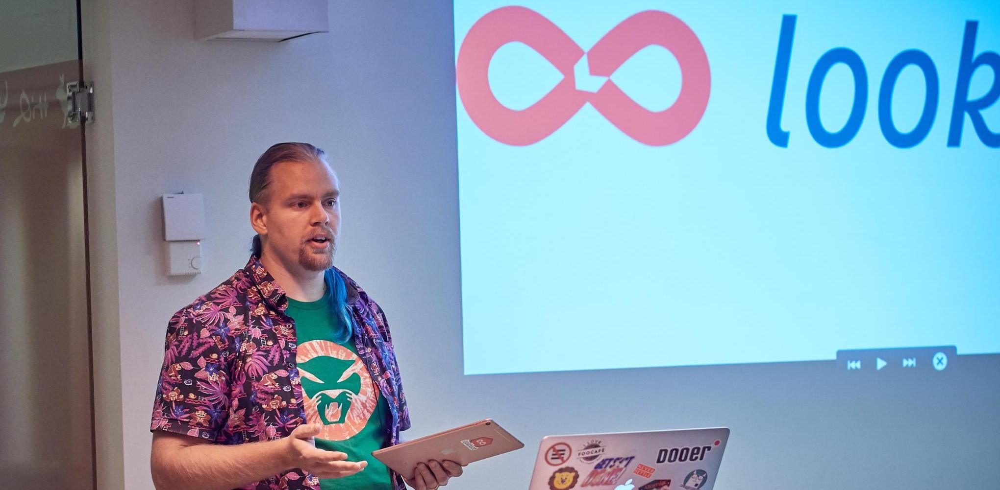

# CocoaHeads #100: Metal for the masses

> 2019-05-27 
> Nevyn Bengtsson (nevyn@lookback.io, [@nevyn](https://twitter.com/nevyn)) 
> [Lookback](https://lookback.io) ([@lookback](https://twitter.com/lookback))

A CocoaHeads Stockholm presentation introducing GPU programming on Metal 2
for regular app developers. Use some fancy gamedev techniques to speed up your
apps.

* [Video of presentation](https://youtu.be/Hzyr-wZCH1w?t=6592)
* [Presentation slides](Presentation/CocoaHeads%20Stockholm%20100%20-%20Metal%20for%20the%20masses.pdf)
* [Presentation notes](Presentation/CocoaHeads%20Stockholm%20100%20-%20Metal%20for%20the%20masses%20-%20Presentation%20notes.rtf)

If you're lucky, sample code accompanying the presentation is forthcoming.
